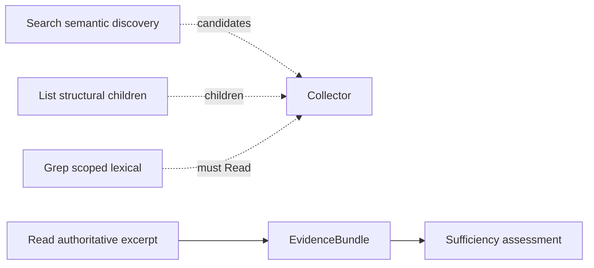
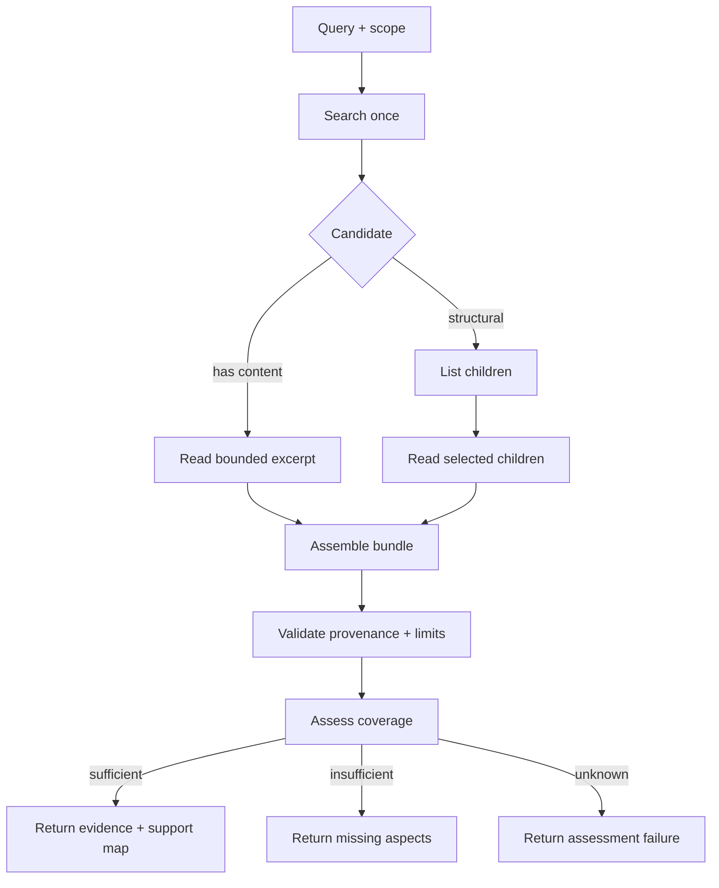
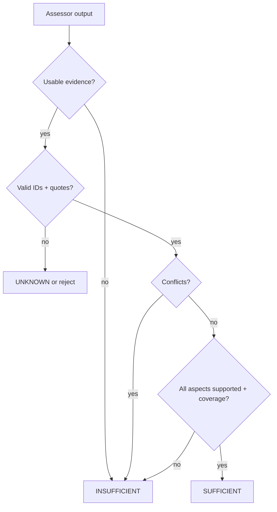

# Retrieval

VikingRAG retrieval has three layers:

1. **Discovery** — Search / List / Grep (compact; not authoritative for final claims)
2. **Evidence** — Read authoritative excerpts, assemble a bundle, assess sufficiency
3. **Answer** — cited generation via Algorithm 1 / Search+ / E+ modes (`POST /v1/answers`, `POST /v1/query`)

Cheap path first: retrieve narrowly → evaluate evidence → answer if sufficient → escalate only when necessary.

## Primitive responsibilities



| Primitive | Authoritative? | Returns |
|---|---|---|
| Search | No | URI candidates, scores, previews |
| List | No | Direct children metadata |
| Grep | No | Match excerpts + offsets (discovery) |
| Read | **Yes** | Exact source text + hash + offsets |

Generated summaries and Search previews must never populate final evidence citations.

## Evidence collection



## Sufficiency policy



- **Coverage** = support ratio across required query aspects (supported=1, partial=0.5).
- Model confidence is **uncalibrated** and never decides sufficiency alone.
- Citation existence ≠ semantic entailment.

## Execution modes

| Mode | Behavior |
|---|---|
| `vikingrag` | Algorithm 1 + ordinary Search |
| `vikingrag_e` | Algorithm 1 + Search+ (experience edges) |
| `vikingrag_e_plus` | One-round Search+ → candidate + strict sufficiency → Alg 1 fallback |

## Shared budgets

One `RetrievalContext` per request tracks tool calls, embeddings, vector searches, read tokens, LLM calls, nodes inspected, and wall time. Nested primitives share the ledger.

## Scope / auth

- `document_ids` on the request may only **narrow** access.
- `permitted_document_ids` is server-derived (auth allowlist). `None` = unrestricted; empty frozenset = allow-nothing.
- Optional `scope_uri` on Search restricts hits to a subtree (`path_ids` containment).

## Grep offsets

Match positions are **Unicode code-point offsets** into stored node text. Patterns are **literal** substrings. No user regex.

## APIs

| Method | Path | Purpose |
|---|---|---|
| `POST` | `/v1/search` | Semantic discovery (`scope_uri` optional) |
| `POST` | `/v1/documents/{id}/index` | Summarize + embed |
| `GET` | `/v1/documents/{id}/index-status` | Index stage |
| `POST` | `/v1/retrieval/list` | Structural children |
| `POST` | `/v1/retrieval/grep` | Scoped lexical matches |
| `POST` | `/v1/retrieval/read` | Authoritative excerpt |
| `POST` | `/v1/retrieval/evidence` | Collect + assess evidence |
| `POST` | `/v1/answers` | Cited answer generation |
| `POST` | `/v1/query` | Mode-switched orchestration |

## Configuration

| Prefix / key | Role |
|---|---|
| `VIKINGRAG_RETRIEVAL_ASSESSOR_PROVIDER` | `scripted` \| `openai` / `openai_compatible` \| `empty` |
| `VIKINGRAG_RETRIEVAL_SUPPORT_SELECTOR` | `deterministic` \| `llm` (Alg 2 SUPPORT) |
| `VIKINGRAG_RETRIEVAL_MAX_*` | Server caps for list/grep/read/bundle |
| `VIKINGRAG_LLM_*` / `VIKINGRAG_EMBEDDING_*` | Providers |

## Examples

### Evidence (dev / fake providers OK)

```bash
curl -s -X POST http://localhost:8000/v1/retrieval/evidence \
  -H 'Content-Type: application/json' \
  -d '{"query":"How do we verify retrieved evidence?","document_ids":["<doc-uuid>"]}'
```

### Answer (needs a real or fake LLM)

```bash
curl -s -X POST http://localhost:8000/v1/answers \
  -H 'Content-Type: application/json' \
  -d '{
    "query": "How do we verify retrieved evidence?",
    "document_ids": ["<doc-uuid>"],
    "execution_mode": "vikingrag_e_plus"
  }'
```

See also [OPERATIONS.md](OPERATIONS.md) and [ARCHITECTURE.md](ARCHITECTURE.md).
