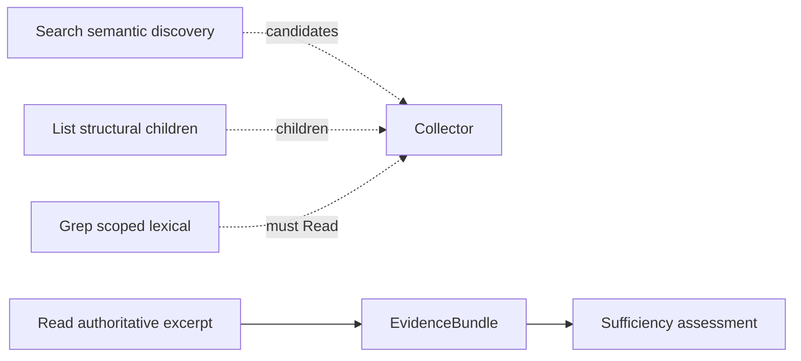
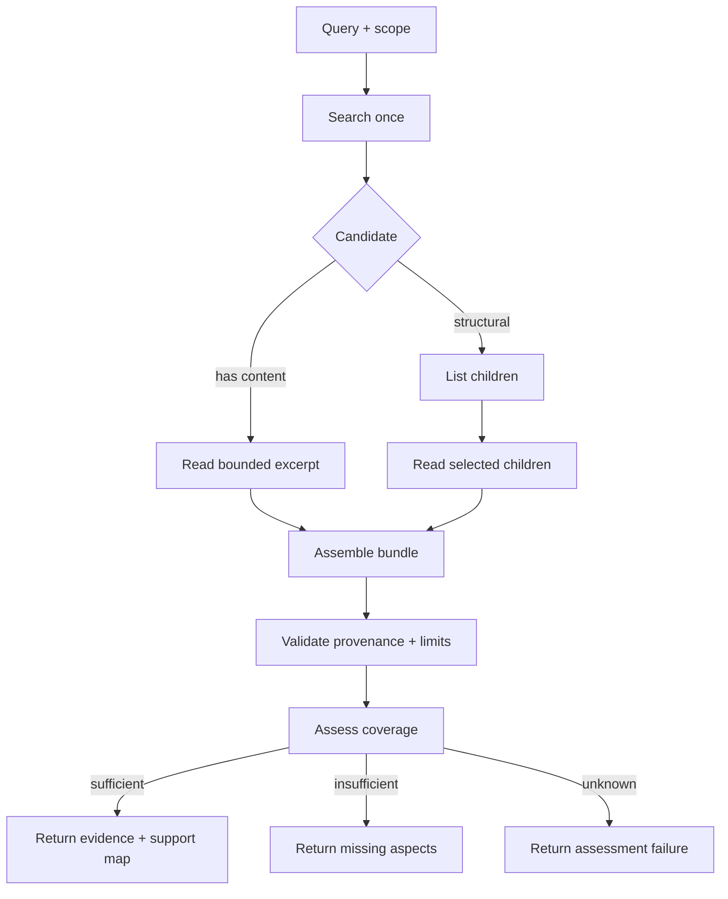
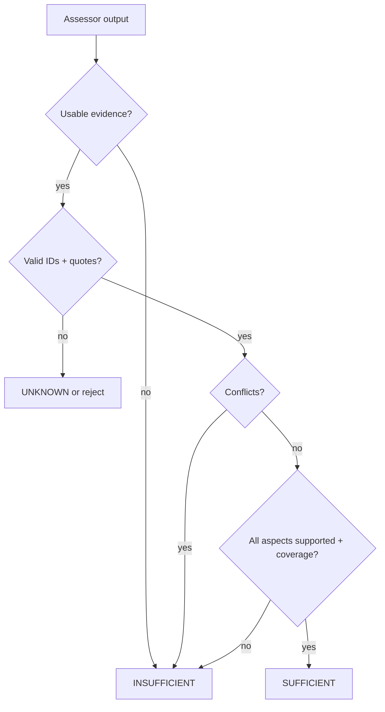

# Retrieval

VikingRAG retrieval has two layers:

1. **Discovery** - Search / List / Grep (compact, non-authoritative for answering)
2. **Evidence** - Read authoritative excerpts, assemble a bundle, assess sufficiency

There is **no answer generation** in this milestone.

## Primitive responsibilities



| Primitive | Authoritative? | Returns |
|---|---|---|
| Search | No | URI candidates, scores, previews |
| List | No | Direct children metadata |
| Grep | No | Match excerpts + offsets (discovery) |
| Read | **Yes** | Exact source text + hash + offsets |

Generated summaries and Search previews must never populate evidence.

## Evidence collection



## Sufficiency policy



- **Coverage** = support ratio across required query aspects (supported=1, partial=0.5).
- Model confidence is **uncalibrated** and never decides sufficiency alone.
- Citation existence ≠ semantic entailment.

## Shared budgets

One `RetrievalContext` per request tracks tool calls, embeddings, vector searches, read tokens, LLM calls, nodes inspected, and wall time. Nested primitives share the ledger. Discarding a duplicate does not refund prior Read work.

## Scope / auth limitation

`document_ids` and `permitted_document_ids` filter content. This is **not** multitenant authentication. Until auth lands, treat the API as trusted-network.

## Grep offsets

Match positions are **Unicode code-point offsets** into stored node text. Patterns are **literal** substrings (`%`, `_`, quotes are literal). No user regex.

## APIs

| Method | Path | Purpose |
|---|---|---|
| `POST` | `/v1/search` | Semantic discovery |
| `POST` | `/v1/documents/{id}/index` | Summarize + embed |
| `GET` | `/v1/documents/{id}/index-status` | Index stage |
| `POST` | `/v1/retrieval/list` | Structural children |
| `POST` | `/v1/retrieval/grep` | Scoped lexical matches |
| `POST` | `/v1/retrieval/read` | Authoritative excerpt |
| `POST` | `/v1/retrieval/evidence` | Collect + assess evidence |

## Configuration

| Prefix / key | Role |
|---|---|
| `VIKINGRAG_RETRIEVAL_ASSESSOR_PROVIDER` | `scripted` \| `openai` / `openai_compatible` \| `empty` |
| `VIKINGRAG_RETRIEVAL_MAX_*` | Server caps for list/grep/read/bundle |
| `VIKINGRAG_LLM_*` / `VIKINGRAG_EMBEDDING_*` | Providers |

## Offline example

With `.env.example` defaults (`deterministic` embeddings, `scripted` assessor):

```bash
make migrate && make docker-up   # or local Postgres/Redis
# ingest + index a fixture, then:
curl -s -X POST http://localhost:8000/v1/retrieval/evidence \
  -H 'Content-Type: application/json' \
  -d '{"query":"How do we verify retrieved evidence?","document_ids":["<doc-uuid>"]}'
```

## Out of scope here

Autonomous agent loops, adaptive multi-round escalation, experience edges, answer generation, claim verification against a final answer.
