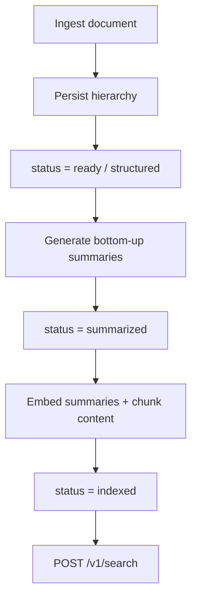
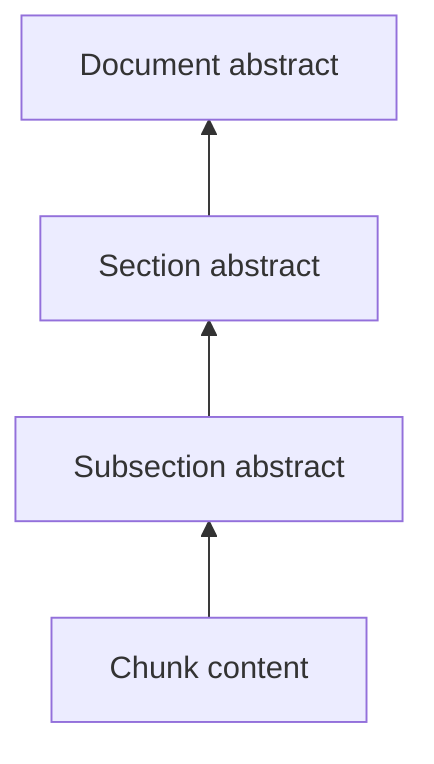
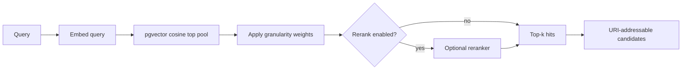

# Retrieval

Semantic discovery for VikingRAG. Structural navigation (List/Read precursors) already exists under document APIs; this document covers **hierarchical abstracts**, **embeddings**, and the **Search** primitive.

## Lifecycle



Structural ingest and AI indexing are **separate**. Failed embedding must not delete a successful hierarchy.

## Hierarchical representations



| Node type | Embedded representation |
|---|---|
| CHUNK | `node_content` (raw chunk text) |
| SUBSECTION / SECTION / DOCUMENT | `node_summary` (bottom-up abstract) |

Parents receive **child summaries**, not full descendant dumps. Token budgets are configurable (`VIKINGRAG_INDEXING_SUMMARY_*`).

## Embedding identity

Every vector is tagged with:

`provider` · `model` · `dimensions` · `identity_version`

Search only compares vectors with a matching **EmbeddingIdentity**.

## Semantic Search



Candidate score (initial model):

```text
score = cosine_similarity * granularity_weight
```

Default weights: document `0.85`, section/subsection/chunk `1.0` (configurable).

Hits include `uri`, `title`, `node_type`, `representation_type`, `score`, `similarity`, `preview` - not full node bodies.

## APIs

| Method | Path | Purpose |
|---|---|---|
| `POST` | `/v1/documents/{id}/index` | Summarize + embed (`force_summaries` / `force_embeddings`) |
| `GET` | `/v1/documents/{id}/index-status` | Index stage + counts |
| `POST` | `/v1/search` | Semantic discovery |

## Configuration

| Prefix | Role |
|---|---|
| `VIKINGRAG_LLM_*` | Summary LLM (`fake` / `openai_compatible`) |
| `VIKINGRAG_EMBEDDING_*` | Embeddings (`deterministic` / `openai_compatible`) |
| `VIKINGRAG_INDEXING_*` | Concurrency and summary budgets |
| `VIKINGRAG_RETRIEVAL_*` | top_k, pool, weights, optional rerank |

Credentials stay in environment variables only.

## Idempotency

- Reuse summary when input fingerprint + generator/model/version unchanged.
- Reuse embedding when representation `content_hash` + embedding identity unchanged.

## Out of scope here

List / Grep / Read tool wrappers, evidence judge, agent loop, experience edges, answer generation.
