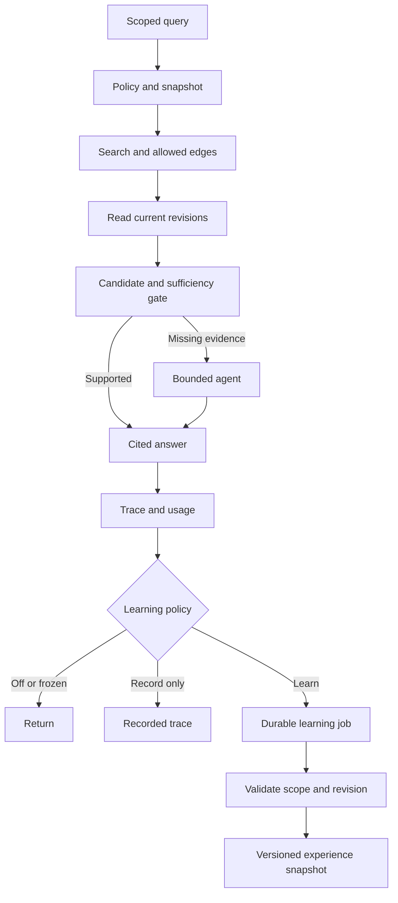
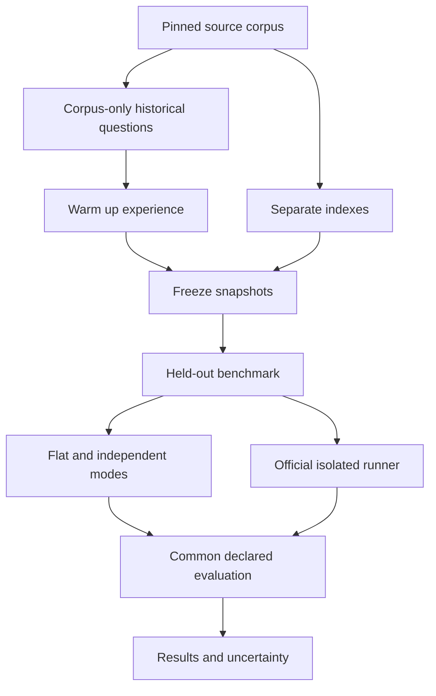

# VikingRAG: official implementation comparison and v0.5.0 plan

Reviewed: 2026-10-08.

## Decision

Keep the independent implementation if the intended product is an auditable Postgres/pgvector retrieval service and SDK for an existing application such as Voca. Its value needs to come from a usable workflow, controlled experience learning, and measured behavior.

The official implementation already exists and is substantial. Do not promote this repository as the first implementation, an original algorithm, or a demonstrated improvement over the official implementation. A Python package, FastAPI routes, Docker, and provider support are useful delivery work, but the official code already contains equivalents.

Recommended description:

**An independent Postgres/pgvector implementation of VikingRAG, with a Python SDK and explicit control over retrieval budgets and experience learning.**

Keep performance claims tied to measurements from this implementation. An independently declared Apache license can be an important adoption choice, but it is not performance evidence or proof that all provenance has been audited.

## Review scope and source snapshots

- Official: [rucdatascience/VikingRAG](https://github.com/rucdatascience/VikingRAG), commit `365d2adc00c8f42517aaef1dd037e0d6f9b58263`.
- Independent: [mhuzaifadev/VikingRAG](https://github.com/mhuzaifadev/VikingRAG/tree/v0.4.3), tag `v0.4.3`, commit `83634a2bd030a53266a89853ffe2d3518343b75b`.
- Both READMEs, repository trees, package metadata, and selected implementation files were inspected. The official API/auth, SDK, parser registry, hierarchical retrieval, relation repository, SUPPORT selector, relation expansion, and evaluation judge were read. Independent retrieval/agent/experience, SDK, evaluation runner/CLI/warm-up, indexing, and SQL repositories were read.
- This is a source comparison, not a full security audit, runtime performance comparison, license provenance audit, or replication of paid experiments.
- Direct git network access was unavailable during this review; current source was retrieved through GitHub.
- No repository changes, commits, releases, or posts were published.

## Comparison

| Area | Official source | Independent v0.4.3 | Implication |
|---|---|---|---|
| Purpose | Reproducible VikingRAG experiment workflow built on OpenViking/Vikingbot, plus broader platform code | Focused document RAG service and SDK | Pick an application use case and make it simpler to adopt |
| Research modes | VikingRAG, E, E+, build-edge stages | Three modes, agent loop, learning jobs, expansion | Matching method names does not establish equivalence or superior results |
| Storage | OpenViking storage; local/HTTP/Volcengine/VikingDB adapters; relation repository with SQLite and legacy compatibility | PostgreSQL/pgvector, SQLAlchemy/Alembic, local/S3 objects | Postgres integration is the strongest concrete architecture distinction |
| SDK/API | Local client, FastAPI server and resource/search/session/relation APIs, bot proxy/streaming infrastructure | VikingRAGClient facade and retrieval/answer/document endpoints | Do not claim the official code lacks an SDK, API, or streaming |
| Auth | Account/user/agent context, API-key manager, roles and tenant-aware retrieval code | Shared API key plus document allowlist; single tenant | Official has broader identity machinery; multi-tenant isolation is not an existing advantage of yours |
| Formats | Registry includes document, spreadsheet, slide, HTML, code and media parsers | Markdown/TXT/PDF and optional DOCX | Expanding format count is not the best first differentiation |
| Retrieval | Hierarchical traversal, dense/sparse vector plumbing, optional reranking, relation expansion | pgvector semantic discovery, structural tools, bounded agent, experience expansion | Do not claim universally better retrieval without matched evaluations |
| Experience storage | RelationRepository/SQLiteRelationStore, query-conditioned matching, build-link strategies | SQL query runs/events/payloads/edges, background jobs, invalidation | Build explicit policies, snapshots and replay around your relational model |
| Embeddings | Benchmark instructions support configured 1024/2048 dimensions; relation storage records dimensions | Current vector storage fixed at 1536 | Your current self-hosting options are constrained by storage dimension |
| Dependencies/build | OpenViking package, larger dependency set, Rust/CMake/native build machinery | Hatch wheel, smaller focused dependency set, no bundled custom native engine | Measure installation/deployment simplicity; dependencies still include native packages |
| Evaluation | Six dataset workflows, pinned preparation, checkpoints, method configs, answer/gold judge and reports | Three real method callables, manifest runner, deterministic presence/non-empty/error metrics | Official currently has a more complete benchmark workflow |
| CI | No GitHub Actions workflow files found in reviewed tree; tests exist | Quality/integration/wheel checks in Actions | This is repository automation coverage, not proof of quality superiority |
| Declared root license | AGPL-3.0 | Apache-2.0 | State licenses accurately; preserve independent implementation and attribution |
| Measured quality/speed | Benchmark execution machinery and paper context | Own result table remains unmeasured | Neither this review nor paper charts establish an independent implementation's result |

### Primary evidence links

- [Official package metadata](https://github.com/rucdatascience/VikingRAG/blob/365d2adc00c8f42517aaef1dd037e0d6f9b58263/pyproject.toml)
- [Official server and routes](https://github.com/rucdatascience/VikingRAG/blob/365d2adc00c8f42517aaef1dd037e0d6f9b58263/openviking/server/app.py)
- [Official authentication](https://github.com/rucdatascience/VikingRAG/blob/365d2adc00c8f42517aaef1dd037e0d6f9b58263/openviking/server/auth.py)
- [Official SDK](https://github.com/rucdatascience/VikingRAG/blob/365d2adc00c8f42517aaef1dd037e0d6f9b58263/openviking/client/local.py)
- [Official parser registry](https://github.com/rucdatascience/VikingRAG/blob/365d2adc00c8f42517aaef1dd037e0d6f9b58263/openviking/parse/registry.py)
- [Official hierarchical retrieval](https://github.com/rucdatascience/VikingRAG/blob/365d2adc00c8f42517aaef1dd037e0d6f9b58263/openviking/retrieve/hierarchical_retriever.py)
- [Official relation storage](https://github.com/rucdatascience/VikingRAG/blob/365d2adc00c8f42517aaef1dd037e0d6f9b58263/openviking/storage/build_link_relation_store.py)
- [Official answer judge](https://github.com/rucdatascience/VikingRAG/blob/365d2adc00c8f42517aaef1dd037e0d6f9b58263/benchmark/RAG/src/core/judge_util.py)
- [Independent package metadata](https://github.com/mhuzaifadev/VikingRAG/blob/v0.4.3/pyproject.toml)
- [Independent evaluation runner](https://github.com/mhuzaifadev/VikingRAG/blob/v0.4.3/src/vikingrag/evaluation/runner.py)
- [Independent warm-up](https://github.com/mhuzaifadev/VikingRAG/blob/v0.4.3/src/vikingrag/evaluation/warmup.py)
- [Independent answer persistence](https://github.com/mhuzaifadev/VikingRAG/blob/v0.4.3/src/vikingrag/application/answer/generate.py)
- [Independent expansion budgets](https://github.com/mhuzaifadev/VikingRAG/blob/v0.4.3/src/vikingrag/application/experience/expand.py)

## What v0.4.3 fixed

Source now contains:
- Enqueue-shaped Search/EDGE_EXPAND/Read events for E+.
- Actual VikingRAG mode callables in evaluation; echo is explicit.
- Source-document-only warm-up sampling and answer/worker-drain wiring.

These previous findings should not be reported as still missing. New source-level coverage exists; this review did not rerun the entire v0.4.3 test suite.

## Remaining release risks

### 1. Evaluation is not enforced read-only

`build_vikingrag_methods()` uses the normal AnswerGenerator. Its successful-answer finalization enqueues learning when a database is present. The runner has no enforced learning policy or immutable snapshot argument.

If a worker is running, held-out queries can change active experience used by later queries/methods. If no worker is running, held-out learning jobs still accumulate and may be processed later. A README instruction to disable learning does not implement that control.

Fix: use a read-only evaluation policy at both enqueue and worker boundaries. Select a corpus/revision and immutable experience snapshot. Verify no jobs/edges change after a held-out run.

### 2. Malformed document filters broaden scope

`_parse_document_ids()` silently skips invalid UUIDs. A manifest filter containing only malformed IDs becomes `()`, the normal no-filter representation.

Focused execution confirmed: `('invalid-document-id',)` parses to `()`.

Fix: validate manifests before any provider/DB work; reject malformed IDs with example ID and field. Never convert malformed explicit scope into unrestricted retrieval.

### 3. All-error evaluation still reports completed

The scripted judge path returns `status="completed"` even when every method result contains an error.

Focused execution confirmed: one example, failing callable, scripted judge gives `completed` and `error_rate=1.0`.

Fix: separate execution status from whether a metrics object was computed. Use failed/partial/completed semantics and a failing CLI exit for failed runs. Keep answer-quality metrics separate from citation-presence metrics.

### 4. Warm-up is still operationally incomplete

- Question generation uses one excerpt capped at 12,000 characters.
- Default M=1000 is requested in one response capped at 4,000 output tokens.
- Questions are not explicitly deduplicated or validated for corpus coverage.
- Real worker-drain path returns `edges_built=0` because the worker exposes only job count.
- `materialize=True` can still return completed if no answer/client path was available.
- CLI generation, materialization and cleanup use separate `asyncio.run()` calls around shared async clients/pools; this needs a live asyncpg test and one lifecycle.
- Text files must currently be placed under corpus/documents; source layout is not an automatic ingest/index pipeline for the six original dataset formats.

Fix: one async lifecycle, batched questions across source documents, explicit corpus-to-ingested-document mapping, truthful generated/materialized/failed counts, and failure when required materialization is unavailable or incomplete.

### 5. Experience limits do not yet match their names

Expansion compares the number of activated payloads to `max_tokens`, rather than tokenizing text. Its wall-clock checks occur around edge lookups, and do not cancel a hanging lookup through the shared RetrievalContext deadline. Scope is not supplied to edge lookup/frontier expansion.

Fix: measure text tokens, reuse the global context for every await, constrain target documents/revisions before activation and traversal, and prevent excluded payload/URI metadata from reaching consumers.

### 6. SDK ownership and silent degradation

The SDK constructs a second embedding provider through `build_search_plus()`; its close method closes only the primary embedding provider. Search+ construction catches every exception and sets the feature to None. E modes can then degrade to ordinary Search.

Fix: share owned providers and search services, close all owned resources once, and fail explicitly for requested unsupported modes.

### 7. Documentation overstates or contradicts implementation

The parity ledger is stale about warm-up and lists a flat-RAG baseline absent from the current runner method map. The README still gives paper charts prominence and describes matching embeddings for providers without a real-provider support matrix.

Fix: list the official repo beside paper attribution, describe current measured capabilities, and update each parity row with implemented/deviation/unverified status based on executed gates.

## Recommended v0.5.0 scope

### Milestone A: controlled experience learning and isolation

Implement:
- Policies `off`, `record_only`, `learn`, `frozen`.
- Corpus/revision/snapshot identity persisted with runs, edges and payloads.
- Snapshot creation, activation, freeze and rollback.
- Preserve authorization independent of learning policy.
- Enforce scope/revision checks during expansion, not only Read.
- Disabled learning suppresses enqueue; workers cannot activate disallowed jobs.

Acceptance:
- Frozen evaluations leave both job and active-edge counts unchanged.
- A scoped query cannot activate, traverse or expose an excluded document's experience payload.
- Document replacement cannot reuse edges to an old revision.
- Snapshot rollback restores the selected edge set without re-embedding documents.

### Milestone B: a genuinely convenient SDK and async lifecycle

Implement:
- Async context manager on VikingRAGClient.
- Public `ingest()`, `index()`, `ask()` methods with typed results.
- Pass learning policy, document scope and mode explicitly.
- Single ownership graph for DB/providers/object store/Search+.
- One event loop for CLI/provider/DB/worker/cleanup.
- Explicit errors for unavailable modes.
- Include a real-provider Voca-style example using sanitized FAQ/policy documents, not a fabricated internal result.

Acceptance:
- Fresh environment example performs ingest → index → scoped answer → close.
- Repeated requests reuse clients; close drains/releases resources.
- E/E+ requests cannot silently become base mode.
- Integration exercise uses real Postgres, not only in-memory substitutes.

### Milestone C: replayable retrieval decisions

Implement:
- Persist event timing, usage, document revision, URI, evidence span, edge identity, activation similarity, sufficiency result and escalation reason.
- Structured trace export and an explain command/endpoint.
- Record schema for request, corpus, provider/model/config identity and experience snapshot.
- Offline replay renders recorded decisions without making new LLM calls; do not call nondeterministic live reruns exact replay.
- Gate trace access with the same document authorization as answers.

Acceptance:
- A user can inspect why E+ escalated and which edges contributed.
- Read spans and citations resolve to the recorded revision.
- Sensitive evidence is omitted from unauthorized exports.
- Deterministic budget/scope decisions can be checked from the trace.

### Milestone D: a credible benchmark

Implement:
- Flat RAG baseline plus the three independent modes.
- Optional official E+ invocation in a separate pinned checkout/container. Do not copy official implementation into the Apache source tree.
- Shared corpus/question manifest and declared unavoidable parser/prompt/budget differences.
- Independent stores and frozen experience for held-out comparisons.
- Corpus-only historical warm-up, separate from test questions.
- Gold-answer evaluation with declared judge/prompt/version; manual review sample.
- p50/p95 latency, input/output tokens, route rate, failure/abstention rate, citation validity and quality. Include all examples; separately report successful-answer conditional metrics.

Initial benchmark:
- One sanitized application corpus.
- 100 held-out questions stratified across simple lookup, section navigation, cross-document reasoning and insufficient evidence.
- Separate historical questions for learning.
- Fix backbone/provider settings, repeat enough runs to show variability, document hardware and caching.
- Quality tolerances must be declared before running the comparison, not invented afterward.
- If official execution is blocked, label the official row not run. Publish the independent vs flat comparison and the exact blockage.

Acceptance:
- Every JSON/CSV row maps to an example and commit/config.
- Malformed manifests fail before provider calls.
- All-error runs are failures, with nonzero CLI exit.
- Learning/worker states do not drift during scoring.
- Graphs are generated from this repo's exports and labeled with sample size and scope.

### Milestone E: independent positioning and release gates

Implement:
- README title clearly identifies an independent implementation.
- Direct link to the official repository and paper.
- Explain Postgres design, smaller package scope and actual workflow with evidence.
- Update stale parity ledger; separate research results from own results.
- Changelog describes user-visible capability and measured limitations.
- Clean wheel install, production Compose startup, scoped learning integration, provider configuration and lifecycle tests in CI.

Acceptance:
- Do not tag v0.5.0 until A–D gates run; mark external/paid gates blocked rather than passed if credentials are unavailable.
- No superiority claim unless the benchmark supports it.
- No official code/prompt copying into independently licensed source without a provenance/licensing review.
- No releases, deployments or posts without the user's authorization.

## Architecture

## Copy-paste implementation prompt

You are implementing v0.5.0 in mhuzaifadev/VikingRAG, starting from v0.4.3.

Goal: deliver an independent Postgres/pgvector document RAG SDK with controlled experience learning, scoped expansion, replayable traces and reproducible evaluation. The official rucdatascience/VikingRAG code already has an SDK, API, auth, Docker and broader benchmark support. Do not treat those generic features as novel.

Read AGENTS.md and the architecture/parity/operations/evaluation docs. Inspect current code before editing. Preserve existing public interfaces where practical.

Implement milestones A–E in this document as one coherent release, using focused commits. Complete correctness controls before adding convenience APIs or charts. Apply settings validation per process role. Fail closed on malformed explicit scopes, preserve auth scope even with injected contexts, and enforce scope/revision/snapshot filters on experience targets and payloads before traversal.

Introduce learning-policy and immutable-snapshot contracts. Held-out evaluation must force frozen/read-only behavior at enqueue and worker boundaries. Recording a trace must not imply learning permission. Keep warm-up questions isolated from evaluation QA/gold files. Generate in batches, deduplicate, track actual question coverage, fail incomplete required materialization, and report actual jobs/edges/failures. Keep clients, pools and cleanup in one event loop.

Make Search+ reuse shared provider resources, close everything exactly once, honor the shared deadline on edge I/O, and charge actual token costs. Requested E/E+ must not silently fall back to ordinary Search if Search+ wiring fails. Merge initial E+ evidence into the agent's authoritative evidence state and learning events so the fallback can cite existing validated Reads without unnecessary repeat work.

Add public async SDK lifecycle and ingest/index/ask convenience methods. Keep advanced services available. Add trace export/explain with scoped access, revision-bound citations, precise route/edge/sufficiency/usage events and explicit distinction between recorded replay and live rerun.

Add a flat-RAG baseline and benchmark exports. Retain all-error and partial-run semantics; return failing exit codes for failures. Invalid document UUIDs must fail manifest validation. Presence of a citation is not citation validity or answer accuracy. Use declared gold-answer judging plus a manual review sample. Build plots from local benchmark exports only.

An optional official runner must execute a separate pinned checkout/container; do not copy AGPL implementation into the Apache codebase. Record config/parser/backbone differences and label unrun comparisons honestly.

Require meaningful gates:
1. Two-document scoped queries cannot return or traverse the excluded document's payload.
2. Frozen held-out runs change no learning jobs or active edges.
3. Replace/delete invalidates old-revision edges and citations.
4. Single E+ fallback preserves initial evidence/citations/events.
5. Real Postgres learning test survives restart and drains jobs correctly.
6. Hanging edge I/O respects global deadline; actual tokens obey limits.
7. Invalid manifests fail before provider calls; all-error runs fail.
8. SDK resource ownership and one-loop CLI lifecycle are verified.
9. Fresh wheel install and documented production Compose work.
10. Benchmark exports reproduce the published metrics.

If provider credentials or Docker are unavailable, complete offline code and tests and report the precise blocked gate. Do not fabricate experiments or mark blocked gates as passed.

Update README, official attribution, parity ledger, operations docs and release notes. Produce a final release report containing changed files, migrations/backward compatibility, executed commands/results, measured benchmark scope and remaining blockers. Prepare the release locally; do not push, publish, deploy or tag until instructed.

